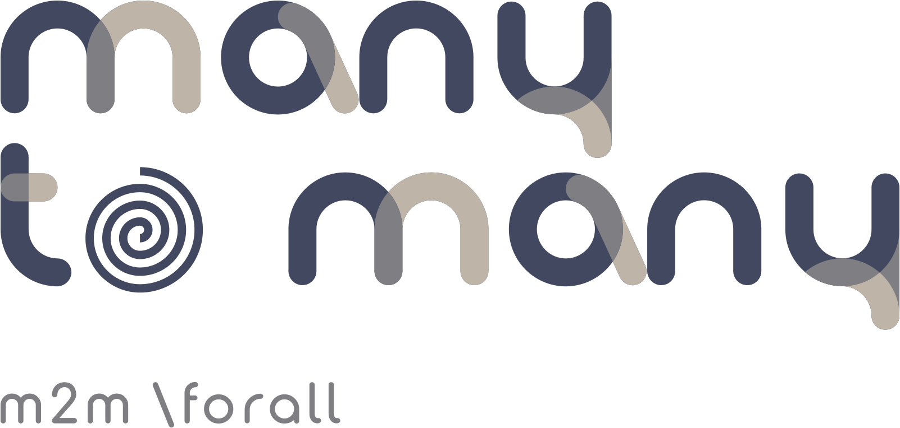

# ManyToMany

A high-performance scientific computing and finite element analysis library for .NET 9.0, written in C# by Pedro Areias (IST).

ManyToMany provides a unified framework for managing complex mesh topologies, sparse linear algebra, mesh generation with crack insertion, nonlinear time integration, and post-processing -- all tuned for large-scale computational mechanics.

## Features

### Relations -- Topology & Connectivity

The core of the library: type-safe many-to-many relationship management for mesh entities.

- **O2M** (One-to-Many) -- single-threaded sparse adjacency
- **M2M** (Many-to-Many) -- thread-safe with cached transpose and position lookups
- **MM2M** (Multi-Many-to-Many) -- multi-type traversal across entity kinds
- **Topology\<TTypes\>** -- generic type-safe topology container with compile-time safety
- **Symmetry** -- canonical representation of symmetry groups
- Automatic serialization and deserialization
- Comparison operators (==, <, >) and set operations (intersection, union, difference)
- Graph algorithms: DFS, BFS, topological ordering, entity coloring
- Smart handles and circulators for mesh navigation
- Lexicographical ordering of all dependence relations

### Matrices -- Linear Algebra

Dense and sparse matrix operations with native accelerator support.

- **Matrix** -- dense operations with BLAS/LAPACK compatibility
- **CSR** -- compressed sparse row format with parallel operations
- **Assembly** -- lock-striped parallel finite element matrix assembly
- SIMD acceleration (AVX2, AVX-512)
- GPU acceleration via CUDA/cuSPARSE
- PARDISO direct solver (Intel MKL)
- LU, QR, SVD decompositions and eigenvalue computation
- Iterative solvers (BiCGSTAB, GMRES)

### Meshing -- Generation & Refinement

Mesh generation, conforming refinement, and fracture mechanics.

- **SimplexMesh** -- core mesh topology container
- **SimplexRemesher** -- longest-edge bisection refinement
- **CrackOperations** -- level-set based crack insertion
- 2D/3D simplex elements (Tri3, Quad4, Tet4)
- Conforming refinement with no hanging nodes
- Multi-format I/O: VTK, MSH, GiD/CIMNE, Ensight

### Nonlinear -- Dynamics & Root Finding

- **Bathe two-stage implicit integrator** -- unconditionally stable, 2nd-order accurate
- Newton-Raphson and variations for nonlinear equation solving
- Compensated (Kahan) summation for numerical stability
- Support for very large systems (>10M DOF)

### Postprocess -- Visualization

- **EnsightWriter** -- export results to Ensight format for visualization in GiD

## Project Structure

```
ManyToMany/
├── Numerical.sln            # Visual Studio solution
├── Relations/               # Topology & connectivity (core library)
├── Matrices/                # Dense/sparse linear algebra
├── Meshing/                 # Mesh generation, refinement, crack insertion
├── Nonlinear/               # Time integration & root finding
├── Postprocess/             # Visualization export
├── Teste/                   # Examples (26 demos: meshing + fracture mechanics)
└── Docs/                    # Detailed documentation
```

## Prerequisites

- [.NET 9.0 SDK](https://dotnet.microsoft.com/download/dotnet/9.0) (x64)
- **Optional:** Intel MKL for PARDISO solver support
  - Windows: installed automatically via NuGet
  - Linux: `sudo apt-get install intel-mkl`
  - macOS: `brew install intel-mkl`
- **Optional:** CUDA toolkit for GPU acceleration

## Building

```bash
dotnet build Numerical.sln -c Release -p:Platform=64
```

## Running the Examples

The `Teste` project contains 26 examples covering advanced meshing and fracture mechanics benchmarks:

```bash
dotnet run --project Teste -c Release -p:Platform=64
```

**Part 1 -- Advanced Meshing** (Examples 1-10): circular domains, L-shapes, annuli, wedges, multiple holes, gear-like geometries, tri vs. quad comparison.

**Part 2 -- 2D Fracture Mechanics** (Examples 11-15): classical benchmarks including Anderson (2005), Griffith (1921), Kanninen & Popelar (1985), Erdogan & Sih (1963), Newman & Raju (1984).

**Part 3 -- Crack Patterns** (Examples 16-20): spiral galaxy, fractal tree, sinusoidal waves, starburst, concentric mandalas.

**Part 4 -- 3D Fracture Mechanics** (Examples 21-26): Sneddon (1946) penny-shaped crack, Irwin (1962) elliptical crack, Tada (1973) edge crack, and more.

All examples output GiD/CIMNE `.msh` files for visualization and a unified Ensight case file.

## Performance

The library is tuned for high-throughput scientific computing:

- **SIMD vectorization** -- AVX2 and AVX-512 intrinsics for dense operations
- **GPU acceleration** -- CUDA/cuSPARSE for sparse matrix operations
- **Parallel processing** -- lock-free and lock-striped algorithms with configurable thread counts
- **Memory efficiency** -- ArrayPool usage, zero-allocation hot paths, stack-allocated spans
- **JIT optimization** -- tiered compilation with profile-guided optimization (PGO)
- **Large-scale support** -- >2GB arrays, >10M DOF simulations

## Platforms

| OS      | Architecture |
|---------|-------------|
| Windows | x64         |
| Linux   | x64         |
| macOS   | x64, ARM64  |

## Documentation

Detailed documentation is available in the `Docs/` directory:

- **Numerical-Complete-Documentation.md** -- dense/sparse matrices, assembly, native integration
- **Topology-Complete-Documentation.md** -- topology operations, algorithms, API reference
- **SimplexRemesher-Complete-Documentation.md** -- mesh refinement, crack insertion, I/O

## License

GPLv3

## Author

Pedro Areias (IST)
